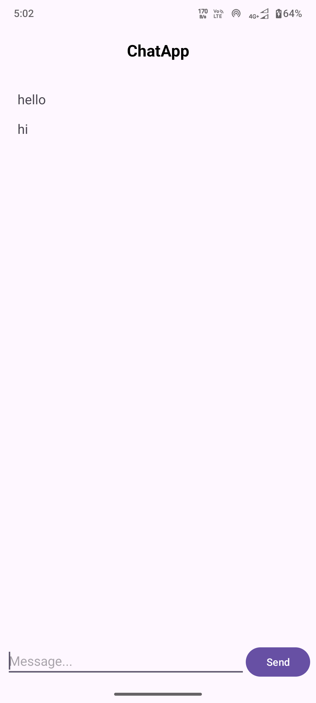

# ChatApp

A simple Android chat screen made using **Java and XML**.

## Features

- Simple ChatApp home screen
- User can type a message
- Send message using the **Send** button
- Message is added to the chat area
- Chat automatically scrolls to the latest message
- Simple and clean UI
- Keyboard support

## Technologies Used

- Java
- XML
- Android Studio

## Screenshots

<table>
  <tr>
    <td ></td>
    <td width="30"></td>
    <td></td>
  </tr>
</table>

## How to Run

1. Clone or download this project.
2. Open the project in Android Studio.
3. Wait for Gradle sync to finish.
4. Connect an Android device or start an emulator.
5. Click **Run**.

## Project Structure

```text
app/
└── src/
    └── main/
        ├── java/
        │   └── MainActivity.java
        └── res/
            └── layout/
                └── activity_main.xml
